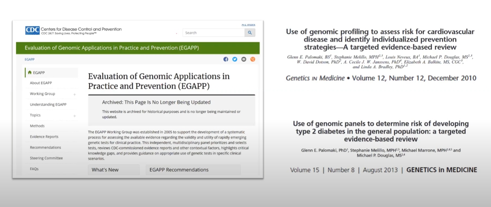
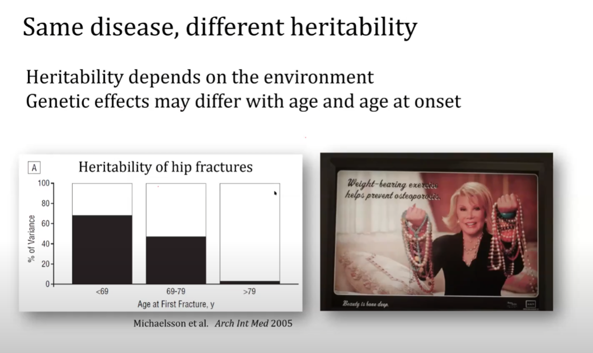

# Screening for Disease

## General Comments

- See, e.g., Nj Wald, AK Hackshaw, CD Frost. 1999. "When can a risk factor be used as a worthwhile screening test?" BMJ 319

## General Comments on Genetic Screening

### Cecile Janssens talk
- See: 
  - Frameworks for assessing genetic risk profiling:
  -   
  - Genetic prediction may be week in the most relevant population:
  - 
    - (Heritability of hip fractures in young people is high, so could be some genetic prediction, but as most hip fractures occur in the elderly for whom this does not apply the usefulness may be limited)  

## Strong Single Gene Genetic Predictors

- HTT 
- PKU
- BRCA
- Colorectal Cancer (what variant?)

## Weak Single Gene Predictors

- PPARG
- CAPN10
- TCF7L2

## PGS

- Unweighted scores 
- Weighted scores 

- Diabetes: **weak PGS**
- Age-related Macular Degeneration: **strong PGS**

# Main

[[s1349795_PHHP_Blog.md]]